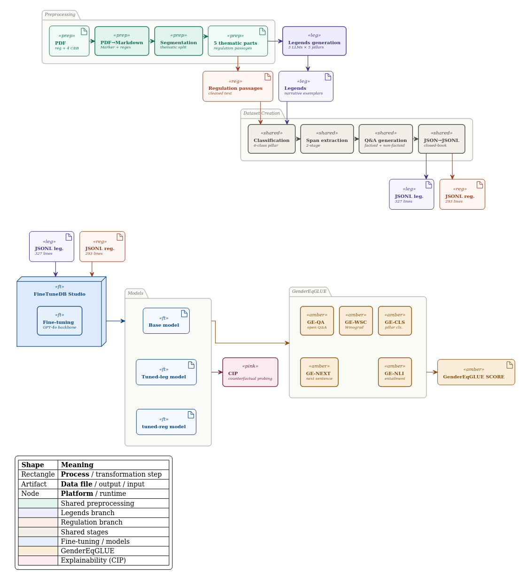

# The Legend Challenge

**Embedding Ethical Compliance into LLMs through Champion Narratives in the Gender Equality Domain**

> Bylyshi, El-Khazri & Ouardi — Department of Computer Science, University of Milan


Developed for the SOASEC *Legend Challenge* at the University of Milan.

---

## 1. Overview

This repository contains the code, datasets, benchmark, and evaluation artefacts for the our **empirical test** of the *Sargsyan–Damiani hypothesis* — the proposal (in *"Using Legends to Embed Ethics Into AI-based Decision-Making"*) that fine-tuning a large language model on **legends** (synthetic narrative exemplars of compliant behaviour derived from a regulation) embeds regulatory ethics more effectively than fine-tuning on the **regulatory text** itself. The original proposal offered neither an empirical test nor a measurement instrument; this work supplies both.

We run a tightly controlled comparison on a **single regulation** (the EU Gender Equality Strategy 2020–2025) and a **single backbone** (`gpt-4o-2024-08-06`), holding the system prompt, chat format, and JSONL line count approximately constant so that **corpus content is the only experimental variable** (legends vs. regulation text).

The codebase delivers three artefacts:

1. **A dataset-construction pipeline** (adapted from the *SustainableQA* framework) that converts unstructured regulatory text and synthetic legends into matched fine-tuning corpora as parallel JSONL files (327 legend lines vs. 293 regulation lines).
2. **GenderEqGLUE** — a five-task benchmark for gender-equality compliance reasoning, adapted one-to-one from GLUE/SuperGLUE templates:
   | Task | Description | GLUE analogue | Metric |
   |------|-------------|---------------|--------|
   | **GE-CLS** | Pillar classification (6-class) | SST-2 | Macro-F1 |
   | **GE-NLI** | Compliance entailment (3-class) | MNLI / RTE | Accuracy |
   | **GE-QA** | Regulation reading comprehension (open-book) | SQuAD / BoolQ | F1 / EM / Acc |
   | **GE-WSC** | Stereotype-aware coreference | WSC / Winogender | Accuracy + Gender Parity |
   | **GE-NEXT** | Compliant-action selection (4-choice) | COPA | Accuracy |
3. **Counterfactual Input Probing (CIP)** — a behavioural-only explainability protocol for closed fine-tuning platforms (FineTuneDB Studio exposes no logits, gradients, or internals, so SHAP, LIME, Integrated Gradients, and attention rollout are all inaccessible). CIP subjects predictions to controlled input variants (original, keyword-stripped, adversarially framed).

### Headline result

| Model | GE-CLS | GE-NLI | GE-QA | GE-WSC | GE-NEXT | **GenderEqGLUE** |
|-------|:------:|:------:|:-----:|:------:|:-------:|:----------------:|
| `base` | 0.833 | 0.899 | 0.929 | 0.930 | 0.927 | 0.904 |
| `tuned-legends` | 0.839 | **0.929** | 0.938 | **0.960** | **0.967** | 0.926 |
| `tuned-regulation` | **0.928** | 0.911 | **0.944** | **0.960** | 0.947 | **0.938** |

The two fine-tuning regimes teach **complementary competences**: legends teach compliance recognition (GE-NLI) and compliant-action selection (GE-NEXT); regulation text teaches ontology recognition (GE-CLS) and short-span factual recall (GE-QA). Per-task wins split 3–3; the base never tops a column. Deployment choice should be governed by the application's dominant risk profile, not by the aggregate.

---

## 2. The Five Pillars

All datasets and the benchmark share a single six-class taxonomy derived from the EU Gender Equality Strategy 2020–2025:

- `violence_stereotypes` — Freedom from violence and stereotypes
- `equal_economy` — Thriving in a gender-equal economy
- `leadership_participation` — Leading equally throughout society
- `mainstreaming_intersectionality` — Gender mainstreaming and intersectional perspective
- `funding_global_action` — Funding and global action for equality
- `unknown` — explicit rejection class (administrative metadata, headers, off-topic passages)

---

## 3. Repository Structure

```
.
├── README.md
├── pipeline.md                         # Narrative description of the end-to-end pipeline
├── SOASEC Legend Challenge mod.pdf     # Original challenge specification (incl. Appendix B: GLUE adaptation)
├── Ethical AI-Regulations_Paper-...pdf # Source paper (Sargsyan & Damiani) being tested
│
├── regulation_dataset/                 # REGULATION branch — corpus + intermediate artefacts
│   ├── original/                       #   raw Strategy PDF + Markdown
│   ├── cleaned/                        #   regex-cleaned Markdown (64,703 → 45,697 chars, -29.4%)
│   ├── chuncked/                       #   two-stage segmentation output
│   ├── regulation_part/                #   5 thematic parts (one per pillar)
│   ├── artifacts/                      #   classified chunks, spans, factoid/non-factoid Q&A (JSON)
│   └── ge-strategy-2020-2025_qa.jsonl  #   final fine-tuning corpus (293 lines)
│
├── legends_dataset/                    # LEGENDS branch — corpus + intermediate artefacts
│   ├── original/
│   │   ├── chat_gpt/  copilot/  gemini/ # 5 legends per model (3 LLMs × 5 pillars = 15 legends)
│   │   └── legends_*.md                 # merged narratives per pillar
│   ├── chunked/                         #   segmented legends
│   ├── classified/                      #   pillar-classified chunks (JSON)
│   ├── artifacts/                       #   spans, factoid/non-factoid Q&A, gen prompt
│   └── legends_qa.jsonl                 #   final fine-tuning corpus (327 lines)
│
├── benchmark/                          # GenderEqGLUE benchmark
│   ├── original/  cleaned/  chunked/   #   4 held-out EU documents → Common Evaluation Base (CEB)
│   ├── task_pool/
│   │   ├── ceb_pool.json               #   217-passage CEB (shared by GE-CLS, GE-NLI, GE-QA)
│   │   ├── ge_cls/                      #   pillar classification items + predictions + metrics
│   │   ├── ge_nli/                      #   168 entailment triples + 5-stage intermediates
│   │   ├── ge_qa/                       #   factoid (SQuAD-style) + bool (BoolQ-style) items
│   │   ├── ge-wsc/                      #   WinoBias (uclanlp/wino_bias) sample + parity metrics
│   │   └── ge_next/                     #   150 compliant-action vignettes + metrics
│   └── results/
│       ├── aggregate_metrics.json
│       └── genderEqGLUE_final_report_final.md
│
├── explainability_gui/
│   └── counterfactual_results_full.csv # CIP 45-cell scoring matrix (5 pillars × 3 variants × 3 models)
│
├── paper/                              # LaTeX sources
│   ├── paper.tex   references.bib   sn-jnl.cls   sn-apacite.bst
│   └── figures/                        #   pipeline diagram + CIP variant figure (PUML/SVG/PDF)
│
├── slides/                             # Presentation deck + plan
│
└── utils/                              # Preprocessing & format-conversion scripts
    ├── pdf2md.ipynb                    #   PDF → Markdown (Marker library)
    ├── markdown_cleaning.py            #   regex cleaning (footnotes, URLs, image refs, blank lines)
    ├── chunking.py                     #   two-stage thematic segmentation (max_words = 350)
    └── json2jsonl.py                   #   Q&A JSON → FineTuneDB JSONL chat format
```

Each task directory under `benchmark/task_pool/` follows a consistent layout: the task `.jsonl`/`.json` pool, a `helpers/` folder with an HTML evaluation console and CSV prediction templates (used because the platform is GUI-only), and a `results/` folder with the computed metrics.

---

## 4. Methodology & Pipeline

The pipeline runs **identically** for both branches, differing only in source content. It adapts and simplifies *SustainableQA*, omitting its table-handling stage (neither corpus contains tabular content).




**Stages**

1. **Preprocessing** — `pdf2md.ipynb` (Marker) + `markdown_cleaning.py`.
2. **Legends generation** — 5 legends per pillar from each of **GPT-5.4 Pro (ChatGPT)**, **Gemini 3 Pro**, and **Microsoft Copilot** via web interface, under an identical system prompt (see `legends_dataset/artifacts/legends_gen_prompt.md` and Listing in the paper appendix).
3. **Six-class pillar classification** — Gemini 3 Pro, single taxonomy reused across both corpora **and** the benchmark CEB.
4. **Two-stage span extraction** — high-recall extraction → verbatim verification + filtering + thematic clustering.
5. **Factoid & non-factoid Q&A generation** — Gemini 3 Pro, JSON output.
6. **Format conversion** — `json2jsonl.py` produces three-turn chat JSONL (system / user / assistant) with a shared system prompt.
7. **Fine-tuning** — FineTuneDB Studio, identical externally-controlled hyperparameters across both runs.

**Common Evaluation Base (CEB).** GE-CLS, GE-NLI, and GE-QA draw from 217 passages extracted from four EU documents that are thematically contiguous with — but absent from — the training corpora: *A Roadmap for Women's Rights (2025)*, *Gender Action Plan III (2021–2025)*, *Council Conclusions on Closing the Gender Pay Gap (2019)*, and *Directive (EU) 2022/2381 on women on boards*. GE-WSC uses **WinoBias** as-is; GE-NEXT is constructed from scratch (150 items).

---
## 5. Key Findings at a Glance

- **Aggregate:** `tuned-regulation` (0.938) ≳ `tuned-legends` (0.926) > `base` (0.904).
- **Hypothesis supported (central formulation):** `tuned-legends` is the strongest model on **GE-NEXT** (compliant-action selection) and **GE-NLI** (compliance recognition), and achieves a **perfect Gender Parity Score (0.000)** on GE-WSC where `tuned-regulation`'s accuracy gain is asymmetric.
- **Hypothesis bounded:** it does **not** extend to ontology classification (GE-CLS) or short-span factoid recall (GE-QA), which favour `tuned-regulation`.
- **CIP:** aggregate robustness is compressed (`base` 86.7%, `tuned-regulation` 86.7%, `tuned-legends` 93.3% at *n*=15), but the **keyword-stripping** variant elicits exactly the failure mode the hypothesis predicts for both non-legend models (a vocabulary tether), and does **not** elicit it from the legend-trained model.

---

## 6. Limitations

Test sets are small (GE-CLS *n*=72, GE-NLI *n*=168, GE-QA-Factoid *n*=123, GE-WSC *n*=100, GE-NEXT *n*=150; CIP *n*=15). The study uses a **single backbone** and a **single regulatory domain**, and is constrained by **closed-platform access** (no model internals). GE-NEXT items are LLM-generated, so residual generator/evaluator affinity cannot be fully ruled out. See the paper's Limitations section for the full account.

---

## 8. Citation

```bibtex
@article{bylyshi2026legendchallenge,
  title   = {The Legend Challenge: Embedding Ethical Compliance into LLMs
             through Champion Narratives in the Gender Equality Domain},
  author  = {Bylyshi, Fatmir and El-Khazri, Hicham and Ouardi, Ilyass},
  journal = {TBD},
  year    = {2026},
  note    = {Preprint}
}
```

This work empirically tests the hypothesis introduced in:

```bibtex
@article{sargsyan2025legends,
  title   = {Using Legends to Embed Ethics Into AI-based Decision-Making},
  author  = {Sargsyan, Gohar and Damiani, Ernesto},
  year    = {2025}
}
```

---

## Reproducing the Study

> **Note on reproducibility.** Several stages depend on external, GUI-only or web-interface services (FineTuneDB Studio for fine-tuning; commercial LLM web UIs for legend generation; Gemini 3 Pro for classification/extraction/Q&A). These steps are **manual** by design and are documented here so the produced artefacts (the JSONL corpora, the benchmark pools, and the metrics) can be inspected and re-derived. Model versions correspond to default settings on 10–15 April 2026.

