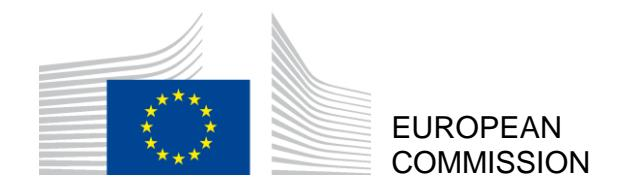

Brussels, 5.3.2020 COM(2020) 152 final

## **COMMUNICATION FROM THE COMMISSION TO THE EUROPEAN PARLIAMENT, THE COUNCIL, THE EUROPEAN ECONOMIC AND SOCIAL COMMITTEE AND THE COMMITTEE OF THE REGIONS**

**A Union of Equality: Gender Equality Strategy 2020-2025** 

**EN EN**

## TOWARDS A GENDER-EQUAL EUROPE

"In all its activities, the Union shall aim to eliminate inequalities, and to promote equality, between men and women."

Article 8 of the Treaty on the Functioning of the European Union

"We should not be shy about being proud of where we are or ambitious about where we want to go."

- President Ursula von der Leyen Political Guidelines

The promotion of equality between women and men is a task for the Union, in all its activities, required by the Treaties. Gender equality is a core value of the EU, a fundamental right1 and key principle of the European Pillar of Social Rights2. It is a reflection of who we are. It is also an essential condition for an innovative, competitive and thriving European economy. In business, politics and society as a whole, we can only reach our full potential if we use all of our talent and diversity. Gender equality brings more jobs and higher productivity3 – a potential which needs to be realised as we embrace the green and digital transitions and face up to our demographic challenges.

The European Union is a global leader in gender equality: 14 of the top 20 countries worldwide on gender equality are EU Member States4. Thanks to robust equal treatment legislation and jurisprudence5, efforts to mainstream the gender6 perspective into different policy areas, and laws to address particular inequalities, the EU has made significant progress in gender equality in the last decades.

&lt;sup>1 See Articles 2 and 3(3) TEU, Articles 8, 10, 19 and 157 TFEU and Articles 21 and 23 of the EU Charter of Fundamental Rights.

Fundamental Rights.

2 https://ec.europa.eu/commission/sites/beta-political/files/social-summit-european-pillar-social-rights-booklet en.pdf.

&lt;sup>3 By 2050, improving gender equality would lead to an increase in the EU's GDP per capita by 6.1% to 9.6%, which amounts to €1.95 to €3.15 trillion: https://eige.europa.eu/gender-mainstreaming/policy-areas/economic-and-financial-affairs/economic-benefits-gender-equality.

&lt;sup>4 As regards the implementation of the Sustainable Development Goal 5 on gender equality, according to the 2019 EM2030 SDG Gender Index: https://data.em2030.org/em2030-sdg-gender-index/.

&lt;sup>5 The EU has adopted six Directives covering equality between women and men in the workplace, in selfemployment, in access to goods and services, in social security, in pregnancy and maternity and on familyrelated leave and flexible working arrangements for parents and carers. Together they have progressively set a legal standard across Europe ensuring a broad protection from discrimination. Numerous cases brought to the European Court of Justice have further strengthened the principle of equality and delivered justice for victims of discrimination.

&lt;sup>6 'Gender' shall mean the socially constructed roles, behaviours, activities and attributes that a given society considers appropriate for women and men, see Article 3(c) of the Council of Europe Convention on preventing and combating violence against women and domestic violence.

**However, no Member State has achieved full gender equality and progress is slow.** Member States on average scored 67.4 out of 100 in the EU Gender Equality Index 20197 , a score which has improved by just 5.4 points since 2005.

**Unfortunately progress with regard to gender equality is neither inevitable nor irreversible. We therefore need to give a new impetus to gender equality.** While the gender gap in education is being closed, gender gaps in employment, pay, care, power and pensions persist. Too many people still violate the principle of gender equality through sexist hate speech and by blocking action against gender-based violence and gender stereotypes. Gender-based violence and harassment continue at alarming levels. The #*MeToo* movement has demonstrated the extent of sexism and abuse that women and girls continue to face. At the same time, it has empowered women across the globe to now come forward with their experiences and bring cases to court.

**This Gender Equality Strategy frames the European Commission's work on gender equality and sets out the policy objectives and key actions for the 2020-2025 period**8 . It aims at achieving a gender equal Europe where gender-based violence, sex discrimination and structural inequality between women and men are a thing of the past. A Europe where women and men, girls and boys, in all their diversity9 , are equal. Where they are *free* to pursue their chosen path in life, where they have equal opportunities to *thrive*, and where they can equally participate in and *lead* our European society.

The implementation of this strategy will be based on the **dual approach** of targeted measures to achieve gender equality, combined with strengthened gender mainstreaming. The Commission will enhance gender mainstreaming by **systematically including a gender perspective in all stages of policy design in all EU policy areas, internal and external**. The strategy will be implemented **using intersectionality**10 – the combination of gender with other personal characteristics or identities, and how these intersections contribute to unique experiences of discrimination – **as a cross-cutting principle**.

In this year of 2020, which marks the 25th anniversary of the adoption of the Beijing Declaration and Platform for Action11 – the first universal commitment and action plan to advance on equality between women and men – **this strategy is the EU's contribution to shaping a better world for women and men, girls and boys**. It delivers on the gender equality Sustainable Development Goal (SDG 5), gender equality as a cross-cutting priority

 7 See European Institute for Gender Equality (EIGE): [https://eige.europa.eu/gender-equality-index/2019.](https://eige.europa.eu/gender-equality-index/2019)

8 Following the Commission's 2016-2019 strategic engagement for gender equality.

9 The expression 'in all their diversity' is used in this strategy to express that, where women or men are mentioned, these are a heterogeneous categories including in relation to their sex, gender identity, gender expression or sex characteristics. It affirms the commitment to leave no one behind and achieve a gender equal Europe for everyone, regardless of their sex, racial or ethnic origin, religion or belief, disability, age or sexual orientation.

10 EIGE defines 'intersectionality' as an "analytical tool for studying, understanding and responding to the ways in which sex and gender intersect with other personal characteristics/identities, and how these intersections contribute to unique experiences of discrimination" (See: [https://eige.europa.eu/thesaurus/terms/1263\)](https://eige.europa.eu/thesaurus/terms/1263). According to Article 10 TFEU, when "defining and implementing its policies and activities, the Union shall aim to combat discrimination based on sex, racial or ethnic origin, religion or belief, disability, age or sexual orientation".

11 [https://beijing20.unwomen.org/en/about.](https://beijing20.unwomen.org/en/about)

of all SDGs12, and on the EU's commitment to the UN Convention on the Rights of Persons with Disabilities.

## 1. Being free from violence and stereotypes

Everyone should be safe in their homes, in their close relationships, in their workplaces, in public spaces, and online. Women and men, girls and boys, in all their diversity, should be free to express their ideas and emotions, and pursue their chosen educational and professional paths without the constraints of stereotypical gender norms.

### Ending gender-based violence

Gender-based violence – or violence that is directed against a woman because she is a woman or that affects women disproportionately13 – remains one of our societies' biggest challenges and is deeply rooted in gender inequality14. Gender-based violence, in all its forms, remains under-reported and overlooked, both inside and outside the EU. The EU will do all it can to prevent and combat gender-based violence, support and protect victims of such crimes, and hold perpetrators accountable for their abusive behaviour.

**33% of women** in the EU have experienced physical and/or sexual violence.

**22% of women** in the EU have experienced violence by an intimate partner.

**55% of women** in the EU have been sexually harassed.

The Council of Europe Convention on preventing and combating violence against women and domestic violence – **the 'Istanbul Convention'** – is the benchmark for international standards in this field. The EU signed the Convention in 2017, and concluding the EU's accession is a key priority for the Commission. To accelerate the conclusion of the EU's accession, the European Parliament requested in 2019 an opinion from the European Court of Justice on this issue15.

Should the EU's accession to the Istanbul Convention remain blocked, the Commission intends to propose in 2021 measures, within the limits of EU competence, to achieve the same objectives as the Istanbul Convention.

The Commission intends in particular to present an initiative with a view to **extending the areas of crime** where harmonisation is possible to specific forms of gender-based violence in accordance with Article 83(1) TFEU, the so-called **Eurocrimes**.

To the extent that they are already apprehended by the existing Eurocrimes within the meaning of Article 83(1) TFEU, the Commission will propose **additional measures to prevent and combat specific forms of gender-based violence**, including sexual harassment, abuse of women and female genital mutilation (FGM).

 $^{12}\ https://ec.europa.eu/europeaid/policies/sustainable-development-goals\_en.$ 

13 Article 3(d) of the Istanbul Convention.

&lt;sup>14 European Union Agency for Fundamental Rights (FRA), 'Violence against women: an EU-wide survey', 2014 – see infographics.

&lt;sup>15 Request for an opinion submitted by the European Parliament pursuant to Article 218(11) TFEU (Opinion 1/19).

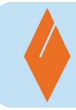

Female genital mutilation16, forced abortion and forced sterilisation, early and forced marriage, so-called 'honour-related violence' and other **harmful practices against women and girls are forms of gender-based violence and serious violations of women's and children's rights** within the EU and around the world. In addition to possible legislation, the EU will table a **Recommendation on the prevention of harmful practices**, including the need for effective pre-emptive measures and acknowledging the importance of education. The recommendation will also address the strengthening of public services, prevention and support measures, capacity-building of professionals and victim-centred access to justice.

The Commission will also present a **Victims**' **Rights Strategy** in 2020, which will address the specific needs of victims of gender-based violence, including domestic violence, building on the Victims' Rights Directive17 .

Women who have a **health problem or disability** are more likely to experience various forms of violence.18 The Commission will develop and finance measures19 to tackle abuse, violence as well as forced sterilisation and forced abortion, such as capacity-building of professionals and awareness-raising campaigns on rights and access to justice.

**Effective prevention of violence is key**. It involves educating boys and girls from an early age about gender equality and supporting the development of non-violent relationships. It also requires a multi-disciplinary approach among professionals and services including the criminal justice system, victim support services, perpetrator programmes and social and health services. Addressing violence against women and ideologies undermining women's rights could also contribute to the prevention of radicalisation leading to violent extremism and terrorism. The Commission will launch an **EU network on the prevention of genderbased violence and domestic violence**, bringing together Member States and stakeholders to exchange good practice, and will provide funding for training, capacity-building and support services. Violence prevention focusing on men, boys and masculinities20 will be of central importance.

To address violence and harassment in work contexts, the Commission will continue to encourage Member States to ratify the **International Labour Organisation (ILO)** 

16 Figures in the infographic are from recent studies by the End FGM European Network, see: [https://www.endfgm.eu/female-genital-mutilation/fgm-in-europe.](https://www.endfgm.eu/female-genital-mutilation/fgm-in-europe)

17 Directive 2012/29/EU establishing minimum standards on the rights, support and protection of victims of crime.

18 For instance, 34% of women with a health problem or disability have experienced physical or sexual partner violence, compared with 19% of women who do not have a health problem or disability. FRA, 'Violence against women: an EU-wide survey', 2014.

19 To implement the UN Committee on the Rights of Persons with Disabilities recommendations for the EU, in particular concerning Articles 6 (Women with disabilities) and 16 (Freedom from exploitation, violence and abuse).

20 According to EIGE, 'masculinities' refers to the "different notions of what it means to be a man, including patterns of conduct linked to men's place in a given set of gender roles and relations", see: [https://eige.europa.eu/thesaurus/terms/1285.](https://eige.europa.eu/thesaurus/terms/1285)

Convention on combating violence and harassment in the world of work21, implement the existing EU rules22 on protecting workers from sexual harassment, and raise people's awareness of them. As an employer, the Commission will adopt a new comprehensive legal framework with a set of both preventive and reactive measures against harassment in the workplace.

Online violence targeting women has become pervasive with specific, vicious consequences; this is unacceptable. It is a barrier to women's participation in public life. Bullying, harassment and abuse on social media have far-reaching effects on women's and girls' daily lives. The Commission will propose the **Digital Services Act**23 to clarify online platforms' responsibilities with regard to user-disseminated content. The Digital Services Act will clarify what measures are expected from platforms in addressing illegal activities online, while protecting fundamental rights. Users also need to be able to counter other types of harmful and abusive content, which is not always considered illegal but can have devastating effects. To protect women's safety online, the Commission will facilitate the development of a new framework for cooperation between internet platforms24.

Women and girls form the vast majority of victims of trafficking in human beings, both in and outside the EU, and are mostly trafficked for the purposes of sexual exploitation25. The EU addresses trafficking in human beings comprehensively through coordination in all relevant areas26. Countering impunity of users, exploiters and profit-makers is a priority. The concerns of women and girls affected by trafficking have to be at the centre of policy development. As part of the Security Union, the Commission will present a new EU strategy on the eradication of trafficking in human beings and an EU strategy on a more effective fight against child sexual abuse.

The EU needs comprehensive, updated and comparable data for policies on combating gender-based violence to be effective. To get a complete picture of gender-based violence, data should be disaggregated by relevant intersectional aspects and indicators such as age, disability status, migrant status and rural-urban residence. An EU-wide survey, coordinated by Eurostat, will provide data on the prevalence and dynamics of violence against women and other forms of interpersonal violence, with results presented in 2023.

#### Challenging gender stereotypes

Gender stereotypes are a root cause of gender inequality and affect all areas of society27. Stereotypical expectations based on fixed norms for women and men, girls and boys, limit their aspirations, choices and freedom, and therefore need to be dismantled. Gender stereotypes strongly contribute to the gender pay gap. They are often combined with other

&lt;sup>21 ILO, Violence and Harassment Convention (No. 190) and Recommendation (No. 206).

&lt;sup>22 Directive 2006/54/EC on the implementation of the principle of equal opportunities and equal treatment of men and women in matters of employment and occupation (recast).

&lt;sup>23 https://ec.europa.eu/digital-single-market/en/new-eu-rules-e-commerce.

&lt;sup>24 Based on cooperation under the EU Internet Forum, which led to the adoption of the EU Code of Conduct on countering illegal hate speech online.

&lt;sup>25 Trafficking in human beings is recognised as violence against women and girls, in line with Article 6 of the UN Convention on the Elimination of All Forms of Discrimination against Women (CEDAW).

&lt;sup>26 Emanating from the Anti-Trafficking Directive 2011/36/EU on preventing and combating trafficking in human beings and protecting its victims.

&lt;sup>27 Special Eurobarometer 465, June 2017 – see infographics.

stereotypes such as those based on race or ethnic origin, religion or belief, disability, age or sexual orientation, and this can reinforce stereotypes' negative impacts.

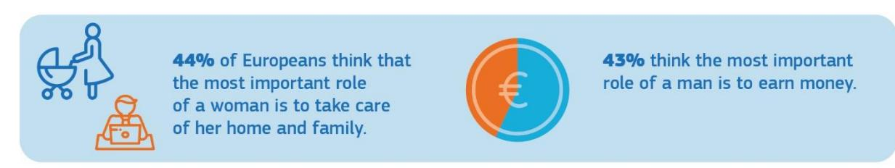

Artificial Intelligence (AI) has become an area of strategic importance and a key driver of economic progress, hence women have to be part of its development as researchers, programmers and users. While AI can bring solutions to many societal challenges, it risks intensifying gender inequalities. Algorithms and related machine-learning, if not transparent and robust enough, risk repeating, amplifying or contributing to gender biases that programmers may not be aware of or that are the result of specific data selection. The new Commission White Paper on AI sets out the European approach grounded in EU values and fundamental rights, including non-discrimination and gender equality28. The next framework programme for research and innovation, **Horizon Europe**29, will also provide insights and solutions on addressing potential gender biases in AI, as well as on debunking gender stereotypes in all social, economic and cultural domains, supporting the development of unbiased evidence-based policies.

The media and the cultural sectors have considerable say in shaping people's beliefs, values and perception of reality, and are thus further key channels for changing attitudes and challenging stereotypes30. The Commission will continue supporting projects promoting gender equality under **Creative Europe**31, including under **Music Moves Europe**, and will present a **gender equality strategy in the audio-visual industry** as part of the next **MEDIA** sub-programme32, including financial support, structured dialogue, mentoring and training for women film-makers, producers and screenwriters.

The Commission will launch an **EU-wide communication campaign combatting gender stereotypes.** It will tackle all spheres of life with an intersectional approach and a focus on youth engagement, in collaboration with the Member States.

&lt;sup>28 European Commission, White paper on Artificial Intelligence - A European approach to excellence and trust, COM(2020) 65 final: https://ec.europa.eu/info/sites/info/files/commission-white-paper-artificial-intelligence-feb2020\_en.pdf.

&lt;sup>29 https://ec.europa.eu/info/horizon-europe-next-research-and-innovation-framework-programme en.

&lt;sup>30 See, for example, 'Gender equality in the media sector', a study carried out for the FEMM Committee on women's rights and gender equality, European Parliament, 2018.

https://ec.europa.eu/programmes/creative-europe/node\_en.

https://ec.europa.eu/digital-single-market/en/media-sub-programme-creative-europe.

#### In addition to the Commission actions listed above, the Commission calls:

#### - on the Council to:

• conclude the EU's accession to the Istanbul Convention and ensure swift EU ratification.

#### on the Member States to:

- ratify and implement the Istanbul Convention;
- ratify and implement the ILO Convention to combat violence and harassment in the world of work:
- implement the Victims' Rights Directive, the Child Sexual Abuse Directive33 and other relevant EU law protecting victims of gender-based violence34;
- systematically collect and report data on gender-based violence; and
- support civil society and public services in preventing and combating gender-based violence and gender stereotyping, including with the help of EU funding available under the "citizens, equality, rights and values" programme (2021-2027).

## 2. Thriving in a gender-equal economy

A prosperous and social Europe depends on us all. Women and men in all their diversity should have equal opportunities to thrive and be economically independent, be paid equally for their work of equal value, have equal access to finance and receive fair pensions. Women and men should equally share caring and financial responsibilities.

#### Closing gender gaps in the labour market

Increasing women's participation in the labour market has a strong, positive impact on the economy, notably in the context of a shrinking workforce and skills shortages. It also empowers women to shape their own lives, play a role in public life and be economically independent.

Women's employment rate in the EU is higher today than ever before35, yet many women still experience barriers to joining and remaining in the labour market36. Some women are structurally underrepresented in the labour market37, often resulting from the intersection of gender with additional conditions of vulnerability or marginalisation such as belonging to an ethnic or religious minority38 or having a migrant background.

&lt;sup>33 Directive 2011/93/EU on combating the sexual abuse and sexual exploitation of children and child pornography.

pornography.

34 In particular, Directive 2011/36/EU on preventing and combating trafficking in human beings and protecting its victims, Directive 2011/99/EU on the European Protection Order, Regulation (EU) No. 606/2013 on mutual recognition of protection measures in civil matters and Council Directive 2004/80/EC relating to compensation to crime victims.

Eurostat, 2019, https://ec.europa.eu/eurostat/web/products-datasets/product?code=sdg\_05\_30 and https://appsso.eurostat.ec.europa.eu/nui/show.do?dataset=lfsi\_emp\_a&lang=en - see infographic.

https://ec.europa.eu/eurostat/statistics-explained/pdfscache/35409.pdf and also FRA, 'Roma Women in nine EU Member States', 2019 – see infographic.

&lt;sup>37 Eurostat, 'Labour Forced Survey', calculations done based on *lfsa\_eegan2* – see infographic.

&lt;sup>38 See, for example, ENAR, 'Racism and discrimination in Employment in Europe 2013-2017', 2017.

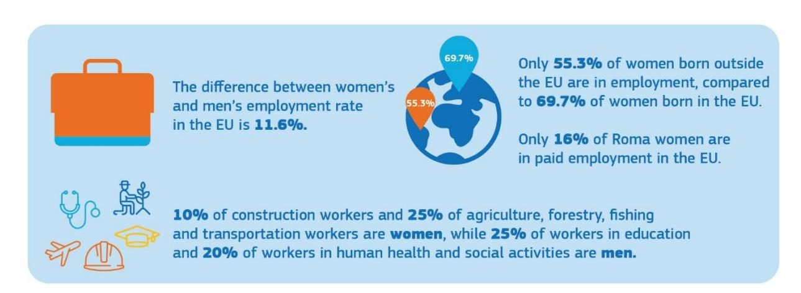

Improving the work-life balance of workers is one of the ways of addressing the gender gaps in the labour market. Both parents need to feel responsible and entitled when it comes to family care. The **Work-Life-Balance Directive**39 introduces minimum standards for family leave and flexible working arrangements for workers, and promotes equal sharing of caring responsibilities between parents. The Commission will ensure that Member States correctly **transpose**40 **and implement** this directive to enable men and women to equally thrive both personally and professionally, and calls upon the Member States to go beyond these minimum standards in reviewing their policies. They should also ensure quality solutions, for instance for childcare, that also reach less populated areas in Europe. Within its own administration, the Commission will promote and monitor an equal use of flexible working arrangements by all employees41.

Gender equality challenges in the Member States, in particular their labour market, social inclusion and education dimensions, will continue to be monitored through the **European Semester**42. Through the Social Scoreboard, the European Semester also monitors these dimensions of the European Pillar of Social Rights43. As of the 2019-2020 Semester cycle, the Semester country reports contribute to the monitoring of the SDGs, including on gender equality (SDG 5), and the way in which economic and employment policies can help deliver on them.

The **structural reform support programme** can support Member States in mainstreaming gender in public administration, state budgeting and financial management. In addition, it can contribute to national structural reforms in Member States to **close the gender employment gap** and to address the higher proportion of women in poverty, particularly in older age.

**Social and economic policies, taxation and social protection systems** should not perpetuate structural gender inequalities based on traditional gender roles in the realms of work and

40 The Work-Life Balance Directive shall be transposed by Member States by 2 August 2022 (and by 2 August 2024 as regards payment of the last two weeks of the minimum of two months of parental leave).

&lt;sup>39 Directive (EU) 2019/1158 on work-life balance for parents and carers.

For existing measures, see European Commission, 'Diversity and Gender Equality Report 2019' (internal document).

&lt;sup>42 https://ec.europa.eu/info/business-economy-euro/economic-and-fiscal-policy-coordination/eu-economic-governance-monitoring-prevention-correction/european-semester\_en.

&lt;sup>43 Principle 2 of the Pillar is about gender equality, while several other principles address gender-related challenges, including the principles on equal opportunities (principle 3), work-life balance (principle 9), childcare and support to children (principle 11), old age income and pensions (principle 15) and long-term care (principle 18).

private life. The Commission will develop guidance for Member States on how national tax and benefits systems can impact **financial incentives or disincentives for second earners**.

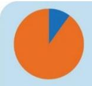

Globally, only **1 in 10** decision-makers at venture capital and private equity firms are female, even though private funds identified as operating with a gender focus have **72%** female partners.

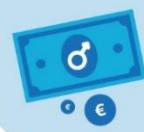

All-male founding teams receive almost 92% of all capital invested in Europe.

Empowering women in the labour market also means giving them the possibility to **thrive as investors and entrepreneurs**44. The EU cohesion policy supports women's entrepreneurship, their (re)integration into the labour market and gender equality in specific, traditionally male, sectors. Targeted measures promoting the participation of women in innovation will be developed under the Horizon Europe **European Innovation Council**, including a pilot to promote women-led start-ups and innovative small and medium-sized enterprises in 202045. The Commission will also promote the presence of women in decision-making positions in private equity and venture capital funds and support funds investing with gender diversified portfolios through the **InvestEU programme** to mobilise private and public investment in Europe for more sustainable, inclusive and innovative growth.

### Achieving equal participation across different sectors of the economy

While there are **more women university graduates in Europe than men graduates**, women remain underrepresented in higher paid professions46. More women than men work in low-paid jobs and sectors, and in lower positions47. Discriminatory social norms and stereotypes about women's and men's skills, and the undervaluation of women's work are some of the contributing factors.

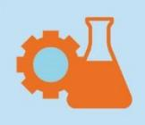

Out of high-performing students in maths or science in OECD countries, **1** in **4** boys expect a career as an engineer or scientist, compared to **1** in **6** girls; **1** in **3** girls expect to work as health professionals, compared to **1** in **8** boys.

The share of men working in the digital sector is **3.1 times** greater than the share of women.

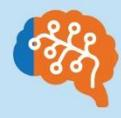

Only **22%** of AI programmers are women.

http://www.oecd.org/pisa/PISA%202018%20Insights%20and%20Interpretations%20FINAL%20PDF.pdf; European Commission, 'Women in the Digital Age – Final Report', 2018; and World Economic Forum Global 'Gender Gap Report 2020' – see infographics.

&lt;sup>44 International Finance Corporation, 'Moving toward gender balance in private equity and venture capital', 2019; Biegel, S., Hunt, S. M., Kuhlman, S., 'Project Sage 2.0 Tracking venture capital with a gender lens', 2019; and Atomico, 'State of European Tech 2019 Report', https://2019.stateofeuropeantech.com/chapter/state-european-tech-2019/article/executive-summary – see infographics.

https://ec.europa.eu/research/eic/index.cfm.

&lt;sup>46 PISA report 2019,

&lt;sup>47 Eurostat, 'A decomposition of the unadjusted gender pay gap using Structure of Earnings Survey data', Statistical working paper, 2018.

The digital transition is of utmost importance in this context. With rapid transformation and digitisation of the economy and the labour market, today 90% of jobs require basic digital skills48. Women only represent 17% of people in ICT49 studies and careers in the EU50 and only 36% of STEM51 graduates52, despite the fact that girls outperform boys in digital literacy53. This gap and this paradox will be addressed in the updated **Digital Education** Action Plan and through the implementation of the Ministerial declaration of commitment on 'Women in Digital'54. The 'Women in Digital' scoreboard will be used more systematically.

The **Updated Skills Agenda for Europe** will help address horizontal segregation, stereotyping and gender gaps in education and training. The Commission proposal for a **Council recommendation on vocational education and training** will support improving gender balance in traditionally male or female-dominated professions and address gender stereotypes. The **reinforced Youth Guarantee** will also specifically address women that are not in education, employment or training to ensure equal opportunities.

In the Commission's forthcoming **communication on the European Education Area**, gender equality will be put forward as one of the key elements. The renewed **strategic framework for gender equality in sport** will promote women's and girls' participation in sport and physical activity and gender balance in leadership positions within sport organisations.

#### Addressing the gender pay and pension gap

The principle of equal pay for equal work or work of equal value has been enshrined in the Treaties since 1957 and translated into EU law. It ensures that there are legal remedies in case of discrimination. Yet, women still earn on average less than men55. Accumulated lifetime gender employment and pay gaps result in an even wider pension gap and consequently older women are more at risk of poverty than men.

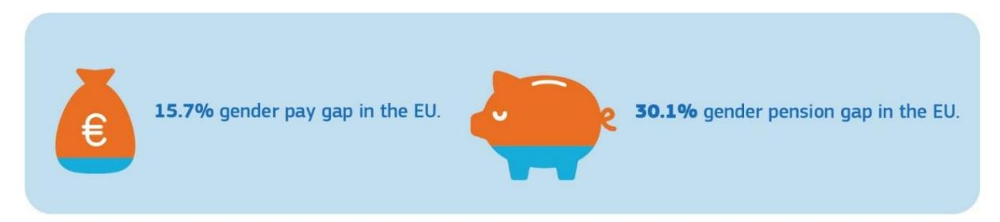

Eliminating the gender pay gap requires addressing all of its root causes, including women's lower participation in the labour market, invisible and unpaid work, their higher use

&lt;sup>48 European Commission, 'ICT for Work: Digital Skills in the Workplace', 2017.

&lt;sup>49 Information and Communications Technology.

&lt;sup>50 https://ec.europa.eu/eurostat/web/products-eurostat-news/-/EDN-20180425-1.

&lt;sup>51 Science, Technology, Engineering and Mathematics.

 $^{52}\ https://op.europa.eu/en/publication-detail/-/publication/9540ffa1-4478-11e9-a8ed-01aa75ed71a1/language-en.$ 

&lt;sup>53 2018 International Computer and Information Literacy Study (ICILS).

https://ec.europa.eu/digital-single-market/en/news/eu-countries-commit-boost-participation-women-digital.

&lt;sup>55 Eurostat, 2018 at https://ec.europa.eu/eurostat/databrowser/product/view/SDG\_05\_20?lang=en; https://appsso.eurostat.ec.europa.eu/nui/show.do?dataset=ilc\_pnp13&lang=en and https://appsso.eurostat.ec.europa.eu/nui/show.do?dataset=ilc\_pnp14&lang=en – see infographics.

of part-time work56 and career breaks, as well as vertical and horizontal segregation based on gender stereotypes and discrimination.

When information about pay levels is available it is easier to detect gaps and discrimination. Because of a lack of transparency, many women do not know or cannot prove that they are being underpaid. The Commission will table **binding measures on pay transparency by the end of 2020**.

Such an initiative will strengthen the rights of employees to get more information about pay levels, while it may add an administrative burden for employers. To find the right balance for such EU action, it is of utmost importance to consult and listen to social partners and national administrations. The Commission undertook a thorough evaluation of the existing framework on equal pay for equal work or work of equal value57. Together with the adoption of this strategy, the Commission is launching a **wide-ranging and inclusive consultation process**58 with the public, the Member States and the social partners. More broadly, the Commission will re-launch the discussion with the **social partners** on how to improve gender equality in the world of work, including within their structures, and encourage them to intensify efforts in addressing the gender employment and pay gaps.

Reduced earnings, higher concentration in part-time work and career gaps linked to women's caring responsibilities contribute substantially to the **gender pension gap**. In the 2021 edition of the **Pension Adequacy Report**, the Commission, together with the Council's Social Protection Committee, will assess how risks and resources are shared in pension systems between women and men. To protect pension rights and encourage equal sharing of care responsibilities between women and men, the Commission will explore with Member States and stakeholders the provision of **pension credits for care-related career breaks in occupational pension schemes**, as recommended by the High-level group on pensions59.

#### Closing the gender care gap

Thriving at work while managing caring responsibilities at home is a challenge, especially for women. Women often align their decision to work, and how to work, with their caring responsibilities and with whether and how these duties are shared with a partner. This is a particular challenge for single parents, most of whom are women60, and for people living in remote rural areas for whom support solutions are often lacking. Women also carry a disproportionate burden of unpaid work, which constitutes a significant share of economic activity61.

-

&lt;sup>56 One of the reasons is the fact that on average women spend fewer hours in paid work than men: whereas only 8% of men in the EU work in part-time, almost a third of women across the EU (31%) does so - see Eurostat, 2018, https://ec.europa.eu/eurostat/web/products-eurostat-news/-/DDN-20190621-1.

&lt;sup>57 Evaluation of the relevant provision in Directive 2006/54/EC implementing the Treaty principle on 'equal pay for equal work or work of equal value', SWD(2020)50; Report on the implementation of the EU Action Plan 2017-2019 on tackling the gender pay gap, COM(2020)101.

&lt;sup>58 To be launched together with this strategy.

&lt;sup>59 Final report of the High-level group of experts on pensions, December 2019, https://ec.europa.eu/transparency/regexpert/index.cfm?do=groupDetail.groupDetail&groupID=3589.

&lt;sup>60 Maldonado, L. C., & Nieuwenhuis, R., 'Family policies and single parent poverty in 18 OECD countries, 1978–2008'. Community, Work & Family, 18(4): 395–415.

61 https://www.ilo.org/wcmsp5/groups/public/---dgreports/---cabinet/documents/publication/wcms\_713376.pdf.

An equal sharing of care responsibilities at home is crucial, as is the availability of childcare, social care and household services, in particular for single parents62. Insufficient access to quality and affordable formal care services is one of the key drivers of gender inequality in the labour market63. Investing in care services is therefore important to support women's participation in paid work and their professional development. It also has potential for job creation for both women and men.

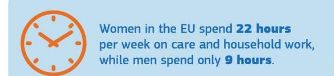

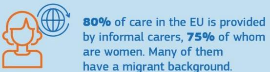

The Barcelona targets64 for the provision of early childhood education and care arrangements for children are mostly met, but some Member States are significantly lagging behind. The Commission will therefore propose to revise the Barcelona targets to ensure further upwards convergence among Member States of early childhood education and care. Moreover, the Commission's proposal for a Child Guarantee in 2021 will focus on the most significant barriers preventing children from accessing the necessary services for their wellbeing and personal development, in order to break the poverty cycle and reduce inequalities.

The Commission will continue supporting Member States' work on improving the availability and affordability of quality care services for children and other dependents through investments from the European Social Fund Plus, the European Regional Development Fund, the InvestEU programme and the European Agricultural Fund for Rural Development.

At the end of 2020, the Commission will launch the consultation process for a Green Paper on Ageing with a focus on long-term care, pensions and active ageing.

### In addition to the Commission actions listed above, the Commission calls on Member **States to:**

- transpose the Work-Life Balance Directive and properly implement EU gender equality and labour law65;
- follow up on the Council conclusions of June 2019 "Closing the Gender Pay Gap: Key Policies and Measures";
- ensure adequate investments in early childhood education, care services and longterm care services including from available EU funding; and
- implement the Ministerial declaration of commitment on "Women in Digital".

62 Eurofound, 'Striking a balance: Reconciling work and life in the EU', 2018 – see infographics.

&lt;sup>63 Hoffmann, F., & Rodrigues, R., 'Informal carers: who takes care of them?', Policy brief, April 2010, European Centre for Social Welfare Policy and Research, Vienna – see infographics.

64 https://ec.europa.eu/info/sites/info/files/bcn\_objectives-report2018\_web\_en.pdf.

&lt;sup>65 This includes the recast Directive on gender equality in employment and occupation, the Directives on gender equality in self-employment, in access to goods and services, in social security, in pregnancy and maternity, the Directive on part-time work, the Directive on transparent and predictable working conditions, the Recommendation on access to social protection, and the Recommendation on equality bodies.

## 3. Leading equally throughout society

Companies, communities and countries should be led by both women and men, in all their diversity. Whether you are a woman or a man should not influence the career you pursue.

### Achieving gender balance in decision-making and politics

There are still far too few women in leading positions. Be it in politics or government agencies, at the highest courts or on companies' boards. This is the case even if gender parity exists at the lower levels. If top positions are held exclusively by men for a long time, this shapes the recruitment pattern for successors, sometimes only due to unconscious bias.

Having both women and men represented is crucial for successful leadership. Inclusive and diverse leadership is needed to solve the complex challenges that decision-makers face today. More inclusion and more diversity is essential to bring forward new ideas and innovative approaches that better serve a dynamic and flourishing EU society. Allowing citizens from all backgrounds to meaningfully participate in society is a necessary precondition for a well-functioning democracy and leads to more effective policy-making66.

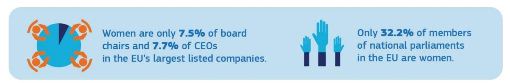

A broad range of talents and skills contributes to better decision-making and corporate governance, and drives economic growth. Despite some progress in recent years, women's under-representation in decision-making positions in Europe's businesses and industry persists. Businesses

To help break the glass ceiling, the Commission will push for the adoption of the 2012 proposal for a **Directive on improving the gender balance on corporate boards**69 which set the aim of a minimum of 40% of non-executive members of the under-represented sex on company boards70.

In parallel, the Commission will facilitate the exchange of good practices addressing gender balance in executive boards and managerial positions, bringing in the examples of national or regional projects run by governments, civil society or the private sector. The **EU Platform of** 

\_

&lt;sup>66 EIGE Gender Statistics Database, National parliaments: Single/lower house, 2019 – see infographic.

&lt;sup>67 ILO, 'The business case for change', 2019; McKinsey, 'Women Matter report', 2017; Catalyst, 'Why Diversity and Inclusion Matter', 2018; Rohini Anand, 'Gender-Balanced Teams Linked to Better Business Performance: A Sodexo Study', 2016.

&lt;sup>68 EIGE, Gender Statistics Database, Women and men in decision-making, 2019 – see infographic.

&lt;sup>69 COM(2012)614 final.

&lt;sup>70 Positive results are shown in several countries that have introduced relevant legislative measures, including France, Italy, Belgium, Germany, and more recently Austria and Portugal. See https://eige.europa.eu/publications/gender-equality-index-2019-report/more-gender-equality-corporate-boards-only-few-member-states.

**Diversity Charters**71 will serve as a platform for exchange. The Commission will continue to cooperate with EU-wide projects, such as the European Gender Diversity Index72.

**Equal opportunity in participation is essential for representative democracy at all levels** – **European, national, regional and local**. The Commission will promote the participation of women as voters and candidates in the **2024 European Parliament elections**, in collaboration with the European Parliament, national parliaments, Member States and civil society, including through funding and promoting best practices. European political parties asking for EU funding are encouraged to be transparent about the gender balance of their political party members73.

In the 2019 European elections **39%** of elected MEPs were women, compared to **37%** of MEPs in 2014.

The von der Leyen Commission has historically the largest share of female Commissioners.

**EU** institutions and bodies should not be exempt from ensuring gender balance in leadership positions. The Commission will lead by example. Thanks to the strong call of President von der Leyen to achieve gender parity in the College of Commissioners, it has the highest number to date of women Commissioners. The Commission aims to reach gender balance of 50% at all levels of its management by the end of 202474. Supporting measures will include quantitative targets for female appointments and leadership development programmes75. The Commission will also increase efforts towards reaching a larger share of female managers in EU agencies76, and will ensure gender balanced representation among speakers and panellists in the conferences it organises.

The Commission will support Member States in developing and implementing more effective strategies to increase the number of women in decision-making positions including through the Mutual Learning Programme in Gender Equality77. The Commission will also disseminate data and analysis of trends on the representation of women and men in decision-making positions in cooperation with the European Institute for Gender Equality (EIGE).

-

&lt;sup>71 https://ec.europa.eu/info/policies/justice-and-fundamental-rights/combatting-discrimination/tackling-discrimination/diversity-management/eu-platform-diversity-charters\_en.

72 Relevant projects include European Women on Boards: https://europeanwomenonboards.eu/.

&lt;sup>73 Regulation 2018/673 amending Regulation (EU, Euratom) No 1141/2014 on the statute and funding of European political parties and European political foundations, recital 6.

&lt;sup>74 In 2019, 41% of managers in the Commission were women (up from 30% in 2014). This included 37% of senior managers (up from 27%) and 42% of middle managers (up from 31%).

&lt;sup>75 For existing measures: European Commission, 'Diversity and Gender Equality Report 2019', Brussels, 6 November 2019.

&lt;sup>76 More than 3 out of 4 EU agencies are currently headed by men.

&lt;sup>77 https://ec.europa.eu/info/policies/justice-and-fundamental-rights/gender-equality/who-we-work-gender-equality/mutual-learning-programme-gender-equality en.

### **In addition to the Commission actions listed above, the Commission calls:**

## - **on the European Parliament and the Council to:**

- adopt the proposal for a Directive on improving the gender balance on corporate boards; and
- adopt measures to improve gender balance at all levels of their management and in leadership positions.

### - **on the Member States to:**

- transpose and implement the Directive on improving the gender balance on corporate boards, once adopted; and
- develop and implement strategies to increase the number of women in decisionmaking positions in politics and policy-making.

# **4. Gender mainstreaming and an intersectional perspective in EU policies**

**The core challenges affecting the EU today – including the green and digital transitions and demographic change – all have a gender dimension**. The inclusion of a gender perspective in all EU policies and processes is essential to reach the goal of gender equality.

Gender mainstreaming ensures that policies and programmes maximise the potential of all – women and men, girls and boys, in all their diversity. The aim is to redistribute power, influence and resources in a fair and gender-equal way, tackling inequality, promoting fairness, and creating opportunity.

The Commission will **integrate a gender perspective in all major Commission initiatives during the current mandate**, facilitated by the appointment of the first Commissioner for Equality, as a stand-alone portfolio, and by creating a **Task Force for Equality**78 composed of representatives of all Commission services and of the European External Action Service. The Task Force will ensure the implementation of equality mainstreaming, including gender equality, at operational and technical level.

As an example, upcoming policies under the **European Green Deal,** such as the **Building Renovation Wave** or the **EU Strategy on Climate Adaptation**, can impact women differently to men79. As regards **climate change**, the role of young women in particular has been remarkable in leading the push for change. Women and men are not equally affected by green policies tackling climate change (there are less possibilities for women as climate refugees), or the clean transition (there are more women in energy poverty), emission-free transport (more women use public transport). Addressing the gender dimension can therefore have a key role in leveraging the full potential of these policies.

Another example is that of **digitisation**, which will fundamentally change our lives and that of our children. In this transition, it is crucial that women help to build that future and that

78 The Task Force will facilitate the mainstreaming of equality relating to six grounds of discrimination: sex, race or ethnic origin, religion or belief, disability, age and sexual orientation.

79 In both cases, specific attention towards elderly people (in terms of future-proof renovations or, for climate adaptation policies, measures during heat waves to improve hydration) will, for example, have a positive impact on women in particular as they form the majority of the elderly population.

many more girls than currently acquire IT skills to be able to play a role in shaping the digital world of tomorrow.

**In health,** women and men experience gender-specific health risks. A gender dimension will be integrated into the EU Beating Cancer Plan to be launched in 2020. Regular exchanges of good practices between Member States and stakeholders on the gender aspects of health will be facilitated, including on sexual and reproductive health and rights.

The **EU Drugs Agenda** 2021-2025 will be adopted in 2020, and will address gender-specific challenges faced by women and girls in substance abuse.

The **intersectionality of gender with other grounds of discrimination will be addressed across EU policies**. Women are a heterogeneous group and may face intersectional discrimination based on several personal characteristics. For instance, a migrant woman with a disability may face discrimination on three or more grounds. EU law, policies and their implementation should therefore respond to the specific needs and circumstances of women and girls in different groups. The forthcoming Action Plan on Integration and Inclusion and the EU strategic frameworks on disability, LGBTI+, Roma inclusion and children's rights will be linked to this strategy and to each other. Moreover, the intersectional perspective will always inform gender equality policies.

## **5. Funding actions to make progress in gender equality in the EU**

The Commission's proposals for the Multi-Annual Financial Framework (MFF) ensure the integration of a gender dimension throughout the financial framework, and more specifically in various EU funding and budgetary guarantee instruments, in particular the **European Social Fund Plus**, the **European Regional Development Fund**, **Creative Europe**, the **European Maritime and Fisheries Fund**, the **Cohesion Fund** and the **InvestEU Programme**. Funding will support actions to promote women's labour market participation and work-life balance, invest in care facilities, support female entrepreneurship, combat gender segregation in certain professions and address the imbalanced representation of girls and boys in some sectors of education and training.

The proposed Common Provisions Regulation80 includes **specific "enabling conditions",** requiring a Member State to have in place a **national gender equality strategic framework** as a precondition to make use of the funds when investing in improving gender balance in the labour market, work-life balance or childcare infrastructure. Another **horizontal 'enabling condition'** on effective implementation of the **Charter of Fundamental Rights** includes gender equality as one of its key principles and applies to all the investments under this regulation.

Dedicated funding for projects benefiting civil society organisations and public institutions that implement specific actions, including preventing and combating gender-based violence, will be available through the **Citizens, Equality, Rights and Values Programme**. Particular attention needs to be paid to women and girls in the asylum and migration area. Through the **Asylum and Migration Fund**, the Commission will encourage Member States to target actions that support the specific needs of women in the asylum procedure, as well as actions that support the integration of women in the new society. Furthermore, the fund will enable

80 COM/2018/375 final.

the stepping up of protection of vulnerable groups, including women victims of gender-based violence in asylum and migration contexts.

In the field of research and innovation, the Commission will introduce new measures to strengthen gender equality in **Horizon Europe**, such as the possibility to require a **gender equality plan from applicants** and an initiative to increase the number of women-led technology start-ups. Funding for gender and intersectional research will also be made available.

There will also be funding opportunities to increase women's entrepreneurship knowledge and participation in decision-making and to invest in basic services' development in rural areas under the **Common Agricultural Policy**. In view of empowering women, a new call dedicated to women in the "blue economy" 81 is planned as part of the next **European Maritime and Fisheries Fund** for 2021-2027.

An Inclusion and Diversity Strategy for the future **Erasmus+ programme** will provide guidance on how the programme can help address gender inequalities in all education and training, youth and sport sectors.

The Commission's guidance on **socially responsible public procurement** will fight discrimination and promote gender equality in public tenders.

In line with repeated calls by several Member States and the European Parliament82 , **the Commission will look at the gender impact of its activities and at how to measure expenditure related to gender equality at programme level** in the 2021-2027 MFF. The outcome of the recently launched audit by the European Court of Auditors on **gender mainstreaming in the EU budget** to promote equality will contribute to this process. This will improve gender mainstreaming in the Commission's budget process, further increasing the contribution made by policy design and resource allocation to gender equality objectives.

# **6. Addressing gender equality and women's empowerment across the world**

**Gender inequality is a global problem. Gender equality and women's empowerment is a core objective of EU external action.** It is important that the EU's internal and external actions in this field are coherent and mutually reinforce each other. The EU promotes gender equality and women's empowerment in its international partnerships, political and human rights dialogues with third countries, EU trade policy as well as in the EU's neighbourhood and enlargement policies, including in the context of accession negotiations and the Stabilisation and Association Process. Moreover, gender-related actions are included in the EU's actions in fragile, conflict and emergency situations.

The **action plan on gender equality and women's empowerment in external relations**  (2016-2020) (GAPII)83 focuses on ending violence against women and girls, promoting women's economic and social empowerment and ensuring the fulfilment of their human,

 81 [https://ec.europa.eu/jrc/en/news/how-big-eus-blue-economy-eu-report-potential-coasts-and-oceans-provide](https://ec.europa.eu/jrc/en/news/how-big-eus-blue-economy-eu-report-potential-coasts-and-oceans-provide-sustainable-economic-growth)[sustainable-economic-growth.](https://ec.europa.eu/jrc/en/news/how-big-eus-blue-economy-eu-report-potential-coasts-and-oceans-provide-sustainable-economic-growth)

82 [http://www.europarl.europa.eu/meetdocs/2014\\_2019/plmrep/COMMITTEES/FEMM/DV/2018/09-](http://www.europarl.europa.eu/meetdocs/2014_2019/plmrep/COMMITTEES/FEMM/DV/2018/09-03/20180828DraftResolutionGenderBudgetingintheEUBudget-thewayforward_EN.pdf) [03/20180828DraftResolutionGenderBudgetingintheEUBudget-thewayforward\\_EN.pdf.](http://www.europarl.europa.eu/meetdocs/2014_2019/plmrep/COMMITTEES/FEMM/DV/2018/09-03/20180828DraftResolutionGenderBudgetingintheEUBudget-thewayforward_EN.pdf)

83 [https://europa.eu/capacity4dev/articles/eu-gender-action-plan-ii-how-eu-delegations-contribute-gender](https://europa.eu/capacity4dev/articles/eu-gender-action-plan-ii-how-eu-delegations-contribute-gender-equality-worldwide)[equality-worldwide.](https://europa.eu/capacity4dev/articles/eu-gender-action-plan-ii-how-eu-delegations-contribute-gender-equality-worldwide)

political and civil rights. Building on the achievements and lessons learned, **GAP III will be launched in 2020**, with a comprehensive approach, and will be coherent with the priorities of this strategy through integrating all its relevant elements into the EU's external action.

The EU will continue supporting women's human rights, its defenders, sexual and reproductive health and rights, and efforts to curb sexual and gender-based violence throughout the world, including in fragile, conflict and emergency situations. The EU initiated the **Spotlight Initiative**, a joint EU-UN global programme with an overall EU allocation of EUR 500 million to eliminate all forms of violence against women and girls. The EU is launching a **campaign #WithHer** in 2020, designed to challenge harmful gender norms and stereotypes, which perpetuate violence against women worldwide. The EU will adopt the **EU Action Plan on Human Rights and Democracy (2020-2024)** in 2020. The EU will also continue to implement the **EU Strategic Approach and Action Plan on Women, Peace and Security** 2019-202484 .

The Commission will continue to actively promote gender equality through its **trade policy**, including through its active engagement on the issue in the World Trade Organisation. It will continue to gather gender-disaggregated data, to ensure that trade-related aspects of gender are adequately addressed in trade agreements and to consider gender impact in trade initiatives.

In partner countries, the EU will make use of the **External Investment Plan** to promote women's entrepreneurship and labour market participation. For instance, the Women's Financial Inclusion Facility alone aims to leverage EUR 100 million for women's access to finance. The **EU Strategy with Africa** in 2020 will also focus on gender equality and women's empowerment.

**In the EU's external policies, gender mainstreaming is used in the budget process**  through the commitment of ensuring that 85% of all new programmes contribute to gender equality and women's empowerment85 .

84 The EU Strategic Approach to Women, Peace and Security (WPS) is annexed to the Foreign Affairs Council Conclusions on WPS adopted on 10 December 2018, (Council document 15086/18), [https://www.consilium.europa.eu/media/37412/st15086-en18.pdf,](https://www.consilium.europa.eu/media/37412/st15086-en18.pdf)

and the EU Action Plan on Women, Peace and Security (WPS) 2019-2024, of 4 July 2019 EEAS(2019) 747, [https://www.consilium.europa.eu/register/en/content/out?&typ=ENTRY&i=ADV&DOC\\_ID=ST-11031-2019-](https://www.consilium.europa.eu/register/en/content/out?&typ=ENTRY&i=ADV&DOC_ID=ST-11031-2019-INIT) [INIT.](https://www.consilium.europa.eu/register/en/content/out?&typ=ENTRY&i=ADV&DOC_ID=ST-11031-2019-INIT)

85 The measurement is done according to the OECD Gender Equality Policy Marker. Specifically for humanitarian aid, the Commission applies its own humanitarian Gender-Age marker.

## **WORKING TOGETHER FOR A GENDER-EQUAL EUROPE**

**Achieving gender equality in the European Union is a joint responsibility.** It requires teaming up and action by all EU institutions, Member States and EU agencies, in partnership with civil society and women's organisations, social partners and the private sector.

The **European Parliament**86 and the **Council**87 have shown their commitment to gender equality in several resolutions and conclusions calling on the Commission to adopt a European Gender Equality Strategy and strengthen gender mainstreaming in all policy areas.

Working together, the EU institutions and Member States need to deepen their engagement with civil society, including women's movements and organisations, international organisations, and governments, to progress on gender equality and continue being global leaders.

The Commission calls on the European Parliament and the Council to take forward their work on the existing and forthcoming Commission proposals in a timely manner. Member States should use all the tools at their disposal, in particular the possibilities offered for EU financial support and ensure the improvement in gender equality.

The key actions presented in this strategy will be regularly updated and supplemented. Their implementation will be monitored, and progress will be reported on an annual basis. These reports will serve as an **annual political stock-taking of progress made**. In addition to examples of good practice in the Member States, the annual reports will also include relevant data, including from Eurostat and Eurofound, as well as indicators for measuring progress, building on EIGE's annual EU Gender Equality Index. EIGE will also provide data and research to feed into the evidence-based policy-making of EU institutions and Member States.

**Working together, we can make real progress by 2025 in achieving a Europe where women and men, girls and boys, in all their diversity, are equal – where they are free to pursue their chosen path in life and reach their full potential, where they have equal opportunities to thrive, and where they can equally participate in and lead our European society.**

87 Recent Council Conclusions on gender equality include: Council Conclusions of 10 December 2019 on gender equal economies in the EU: The way forward – taking stock of 25 years of implementation of the Beijing Platform for Action; Council Conclusions of 24 October 2019 on The Economy of Wellbeing; Council Conclusions of 13 June 2019 on Closing the Gender Pay Gap: Key Policies and Measures.

and men in the European Union in 2014-2015.

 86 Recent resolutions of the European Parliament on gender equality include: European Parliament resolution [2019/2870\(RSP\)](http://www.europarl.europa.eu/oeil/popups/ficheprocedure.do?lang=en&reference=2019/2870(RSP)) of 30 January 2020 on the gender pay gap; European Parliament resolution [2019/2855\(RSP\)](http://www.europarl.europa.eu/oeil/popups/ficheprocedure.do?lang=en&reference=2019/2855(RSP)) of 28 November 2019 on the EU's accession to the Istanbul Convention and other measures to combat genderbased violence; European Parliament resolution [2016/2249\(INI\)](http://www.europarl.europa.eu/oeil/popups/ficheprocedure.do?lang=en&reference=2016/2249%28INI%29) of 14 March 2017 on equality between women